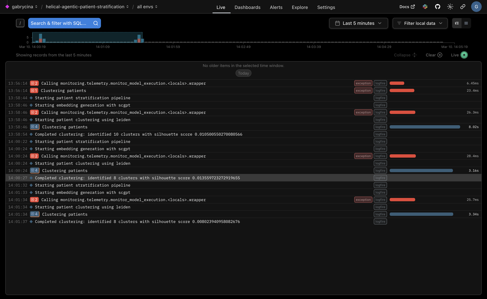

# 🧬 Helical Agentic Patient Stratification

Quick demo showing how to use Helical + PydanticAI + Logfire for patient stratification based on gene expression data.

## What it does

- Takes gene expression data (h5ad format)
- Uses scGPT/Geneformer for embeddings
- Clusters patients using Leiden algorithm
- Uses LLM to interpret results
- Logs everything with Logfire 📊

## Quick Start

```bash
python -m venv .venv
source .venv/bin/activate 

pip install -r requirements.txt

python main.py
```

## Configuration

Create a `.env` file with the following environment variables:

```bash
LOGFIRE_API_KEY=
OPENAI_API_KEY=
```

## Monitoring with Logfire

Model executions and clustering operations can be monitored in real-time:



The dashboard shows:
- Model execution times ⚡
- Clustering results 📊
- Silhouette scores 📈
- Any errors/warnings ⚠️